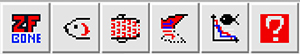
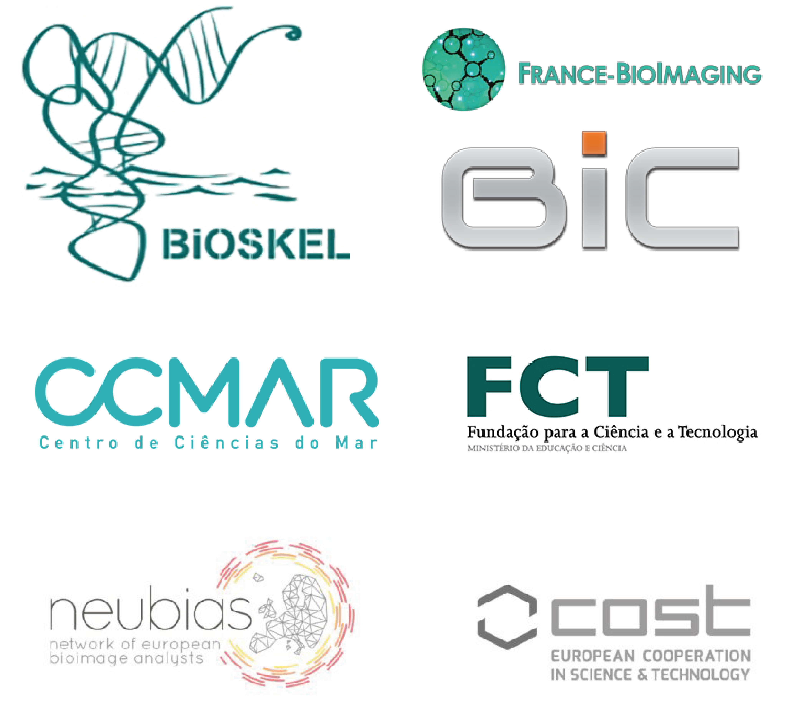

# ZFBONE 
 

*Developed by Marco Tarasco, Fabrice Cordelières, M. Leonor Cancela , Vincent Laizé*
## Introduction

ZFBONE is a FIJI-based toolset that provides tools needed for a rapid, reliable and semi-automatized morphometric analysis of zebrafish bone structures to identify compounds that have an effect on bone formation, mineralization or patterning in zebrafish. These tools are used to screen/study compounds with bone anabolic effects (osteoactives) and bone toxic effects (osteotoxicants).

## The idea
The idea is to provide the zebrafish community with a set of semi-automatic tools to assess the effects of bioactive compounds on several bone structures (e.g. operculum, caudal fin ray and scale). 

ZFBONE is:

- Easily implementable in any laboratory
- Use standard image formats (i.e. TIFF and BMP)
- It has a user-friendly interface
- It is developed in ImageJ/FIJI, thus it is open-source and easy to modify
- It delivers final data in a simple format (.csv) and a graphical output for *a posteriori* confirmation of the analysis

## How to install/run it?
Download the file "**ZFBONE.ijm**" from the repository and save it in the FIJI folder for macros. 

File location is: Applications\Fiji\macros\toolsets\ **ZFBONE.ijm**

Open FIJI, go to the "More tools" menu and click on ">>" in the toolbar then select the option “ZFBONE”. 

ZFBONE toolbar will appear in the main FIJI toolbar.

*The same procedure can be used for ImageJ.*

## How to cite us?
Please cite us accordingly: **Manuscript just submitted!**

## Contact us
ZFBONE is only a starting point for the development of more sophisticated tools. Send us your feedbacks or ideas to improve the toolset. 

E-MAIL: **mtarasco@ualg.pt**

## How to use it?

ZFBONE toolbox proposes the following macros:

*	Operculum assay
*	Scales assay
*	Caudal fin assay
*	Ray bone intensity

 

***
###### OPERCULUM ASSAY  

**Quick introduction**

The *operculum assay* was developed to assess either the operculum mineralized area in wild-type larvae stained with bone-specific dye (i.e. alizarin red S or calcein) or the bone cell content in transgenic larvae expressing fluorescent proteins. 

More info about the assay are available in the publication: 

Tarasco M, Laizé V, Cardeira J, Cancela ML, Gavaia PJ, 2017. The zebrafish operculum: a powerful system to assess osteogenic bioactivities of molecules with pharmacological and toxicological relevance. Comp. Biochem. Physiol. Part C 147, 45–52. 

**Input data**

Depending on the type of analysis, 1 channel / 2 channel images (e.g. TIFF or BMP) need to be opened to start the analysis. Check in the folder **Test images** to download sample images and test the macro.

**Output data**

The macro will automatically create a folder (*"analyzed"*) in the same image directory which will contain the result table, a screenshot of the image analized showing the ROI selected and the ROI manager content for *a posteriori* verification and in the case the user wants to perform additional measuraments.

**How to use it?  Check the tutorial!**

***
###### SCALES ASSAY 
**Quick introduction**

The *scale assay* was developed to automatically analyse individual or multiple scales to evaluate (following the initial user selection) osteoclast activity (TRAP stained scales) and demineralized bone (von Kossa stained scales).

From each scale the macro will return: scale area, circularity, aspect ratio, TRAP positive area/Demineralized area (dependign on the analysis) and a normalized TRAP positive area/Demineralized area over the total scale area. 

More info about the assay area available in the publication: 

De Vrieze E, Van Kessel MAHJ, Peters H M, Spanings FAT, Flik G, & Metz JR,(2014). Prednisolone induces osteoporosis-like phenotype in regenerating zebrafish scales. Osteoporosis Int, 25(2), 567-578.

**Input data**

User opens an image (RGB color image) to initiate the analysis. Check in the folder **Test images** to download sample images and test the macro.

**Output data**

The macro will automatically create a folder (*"analyzed"*) in the same image directory which will contain the result table, a screenshot of the image analized showing the ROI selected and the ROI manager content for *a posteriori* verification and in the case the user wants to perform additional measuraments.

**How to use it?  Check the tutorial!**

***
###### CAUDAL FIN ASSAY 
**Quick introduction**

The *caudal fin assay* was developed to assess mineral content, ray morphometry or osteoclas activity in regenerated caudal fin stained with bone specific staining (alizarin red S or calcein) or TRAP. 

More info about the assay area available in the publication: 

Cardeira J, Gavaia PJ, Fernández I, Cengiz IF, Moreira-Silva J, Oliveira JM, Reis RL, Cancela ML, Laizé V, 2016. Quantitative assessment of the regenerative and mineralogenic performances of the zebrafish caudal fin. Sci. Rep. 6, 39191.

**Input data**

User will open a bright-field image and then a fluorescent image (i.e. the correspondent fluorescent image) to initiate the analysis. Both images (e.g. TIFF or BMP) can be of 1 channel or 3 . Check in the folder **Test images** to download sample images and test the macro.

**Output data**

The macro will automatically create a folder (*"analyzed"*) in the same image directory which will contain the result table, a screenshot of the image analized showing the ROI selected and the ROI manager content for *a posteriori* verification and in the case the user wants to perform additional measuraments.

**How to use it?  Check the tutorial!**

***
###### RAY BONE INTENSITY 
**Quick introduction**

The *ray bone intensity assay* was developed to assess caudal fin ray intensity from imaged previously acquired through micro-computed tomography (microCT). The user in the menu, can choose either *Ray analysis* which allows the user to collect pixel intensity data from each ray (upon manual selection), or *Data pooling* option which will open the results previously collected (with Ray analysis) and allow the user to compare different caudal fins in the same intensity plot (for example control vs treated fins).

**Input data**

The macro will ask the user to first open an image (macro developed on microCT aquisitions saved ). Check in the folder **Test images** to download sample images and test the macro.

**Output data**

The macro will automatically create a folder ("analyzed") in the same image directory which will contain the result table. In the result table, each ray intensity profile will be saved as raw data, aligned data and the normalized to 1 data. In the folder will be saved also the analysed image showing the rays selected, the respectively intensity plot and the ROI manager content in case the user wants to perform additional measuraments.

**How to use it?  Check the tutorial!**

***
# Acknowledgements
We are thankfull for the support of the following labs & institutions

	

