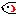
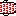
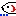
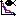
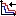

# ZF BONE tools     
*Developed by Marco Tarasco & Fabrice Cordelières.*
## Introduction

Bone disorders affect millions of people worldwide and available therapeutics have a limited efficacy, often presenting undesirable side effects. As such, there is a need for novel molecules with bone anabolic properties. 
Several zebrafish systems have been established to assess the effects of coumpounds on bone formation, mineralization and patterning. 

The aim of this work was to establish a rapid, reliable and reproducible set of semi-automized tools to screen for molecules with osteo-activities.

The same tools can be applied to screen molecules with bone anabolic effects or to evaluate the effects of pollutant on bone (osteotoxicity).

## How to install/run it?
Download the file **"ZF Bone tools.ijm"** from the repository and drag it to the directory: 
⁨

Applications ▸ Fiji⁩ ▸ ⁨macros⁩ ▸ toolsets ▸ ZF Bone tools.ijm

Then open Fiji, click on the last bottom of the toolbar: ">>" icon ("More tools" menu) and click on ZF Bone tools.

Now ZB BONE toolbar will appear on the main Fiji toolbar.

*The same steps will work for ImageJ.*

## How to cite us?
Please cite us accordingly: Tarasco et al., 2020.......

## How to use it?

ZF BONE tools is composed by different macros:

* Operculum assay
* Operculum assay batch mode
* Scales assay
* Caudal fin assay
* Ray bone density
* Data puller 

***
###### OPERCULUM ASSAY  

**Quick introduction**

The *operculum assay tool* allows the user to automatically measure the area of the head and the area of the operculum. It will then compute and return the ratio to normalize for inter-specimen variability.

This macro is based on the publication: Tarasco, M., Laizé, V., Cardeira, J., Cancela, M.L., Gavaia, P.J., 2017. The zebrafish operculum: a powerful system to assess osteogenic bioactivities of molecules with pharmacological and toxicological relevance. Comp. Biochem. Physiol. Part C 147, 45–52. 

**Imput data**

The macro needs an open image (RGB and flurorescent image) to start the process.
In case other type of images are opened, the macro will recognize it and stop the process. 

**Output data**

The macro will automatically create a folder (*"analized"*) in the same image directory which will contain the result table and a screenshot of the image analized showing the results and the ROI selected. This allows the user to confirm that all the  area selected are in fact the one wanted. 

**How to use it**

Simply drag/open an image in Fiji and press the corresponded icon. 
The user will be asked to draw the first region of interest (i.e. the fish head) and then the second region of interest (i.e. the operculum).
In case one ROI is missing the macro will stop and wait for the missign ROI to proceed.

###### OPERCULUM ASSAY BATCH MODE  
This macro uses the same principles and fuction of the operculum assay. 
The only difference is that by cliking on the *operculum assay batch mode* the user will be asked to open the directory containing the images to be analyzed and it will start automatically opening one by one.
How to use the macro and the output are complitely the same of the *operculum assay*. In the case the user stops analysing the images and re-open the same folder afterwards, the macro will recognize the images that were already analized and it will restart from the last image that was not analyzed.

***
###### SCALES ASSAY 
**Quick introduction**

The *scale assay tool* allows the user to automatically analyse individual or multiple scales to evaluate osteoclast activity (scales stained through
TRAP enzymatic assay) or demineralized bone (scales stained through Von Kossa). Once the user click on this tool, it will be asked to select which kind of scales assay was performed. 

From each scale the macro will return: scale area, circularity, aspect ratio, corrected circularity, TRAP positive area/Demineralized area (dependign on the analysis) and a normalized TRAP positive area/Demineralized area over the total scale area. 

This macro was developed and published in the publication: Tarasco et al., XXXX

**Imput data**

The macro needs an open image (RGB and brigthfield image) to start the process. In case other type of images are opened, the macro will recognize it and stop the process.

**Output data**

The macro will automatically create a folder ("analized") in the same image directory which will contain the result table named accordigly to the type of staining assay chosen and a screenshot of the image analized showing the scales selected and the respectively TRAP positivie/demineralized areas. This allows the user to confirm that all the area selected are in fact the one wanted.

**How to use it**

***
###### CAUDAL FIN ASSAY 
**Quick introduction**

**Imput data**

**Output data**

**How to use it**

***
###### RAY BONE DENSITY 
**Quick introduction**

**Imput data**

**Output data**

**How to use it**

***
###### DATA PULLER 
**Quick introduction**

**Imput data**

**Output data**

**How to use it**
***
## How does it work?
fdsvdsvdvssd
dsvdsvdsv

vdsvd
vdsvs

-

 

	

