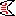

# ZF BONE tools     
*Developed by Marco Tarasco & Fabrice Cordelières.*
## Introduction

Bone disorders affect millions of people worldwide and available therapeutics have a limited efficacy, often presenting undesirable side effects. As such, there is a need for novel molecules with bone anabolic properties. 
Several zebrafish systems have been established to assess the effects of coumpounds on bone formation, mineralization and patterning. 

The aim of this work was to establish a rapid, reliable and reproducible set of semi-automized tools to screen for molecules with osteo-activities, based on already existing zebrafish systems.

The same tools can be applied to screen molecules with bone anabolic effects or to evaluate the effects of pollutant on bone (osteotoxicity).

## How to install/run it?
Download the file **"ZF Bone tools.ijm"** from the repository and drag it to the directory: 
⁨

Applications ▸ Fiji⁩ ▸ ⁨macros⁩ ▸ toolsets ▸ ZF Bone tools.ijm

Then open Fiji, click on the last bottom of the toolbar: ">>" icon ("More tools" menu) and click on ZF Bone tools.

Now ZB BONE toolbar will appear on the main Fiji toolbar.

*The same steps will work for ImageJ.*

## How to cite us?
Please cite us accordingly: Tarasco et al., 2020.......

## How to use it?

ZF BONE tools is composed by different macros:

* Operculum assay
* Operculum assay batch mode
* Scales assay
* Caudal fin assay
* Ray bone density
* Data puller 

***
###### OPERCULUM ASSAY  

**Quick introduction**

The *operculum assay tool* allows the user to automatically measure the area of the head and the area of the operculum. It will then compute and return the ratio to normalize for inter-specimen variability.

This macro is based on the publication: Tarasco, M., Laizé, V., Cardeira, J., Cancela, M.L., Gavaia, P.J., 2017. The zebrafish operculum: a powerful system to assess osteogenic bioactivities of molecules with pharmacological and toxicological relevance. Comp. Biochem. Physiol. Part C 147, 45–52. 

**Imput data**

The macro needs an open image (RGB and flurorescent image) to start the process.
In case other type of images are opened, the macro will recognize it and stop the process. 

**Output data**

The macro will automatically create a folder (*"analized"*) in the same image directory which will contain the result table and a screenshot of the image analized showing the results and the ROI selected. This allows the user to confirm that all the  area selected are in fact the one wanted. 

**How to use it?  check the tutorial!**

###### OPERCULUM ASSAY BATCH MODE  
This macro uses the same principles and fuction of the operculum assay. 
The only difference is that by cliking on the *operculum assay batch mode* the user will be asked to open the directory containing the images to be analyzed and it will start automatically opening one by one.
How to use the macro and the output are complitely the same of the *operculum assay*. In the case the user stops analysing the images and re-open the same folder afterwards, the macro will recognize the images that were already analized and it will restart from the last image that was not analyzed.

***
###### SCALES ASSAY 
**Quick introduction**

The *scale assay tool* allows the user to automatically analyse individual or multiple scales to evaluate osteoclast activity (scales stained through
TRAP enzymatic assay) or demineralized bone (scales stained through Von Kossa). Once the user click on this tool, it will be asked to select which kind of scales assay was performed. 

From each scale the macro will return: scale area, circularity, aspect ratio, corrected circularity, TRAP positive area/Demineralized area (dependign on the analysis) and a normalized TRAP positive area/Demineralized area over the total scale area. 

This macro was developed and published in the publication: Tarasco et al., XXXX

**Imput data**

The macro needs an open image (RGB and brigthfield image) to start the process. In case other type of images are opened, the macro will recognize it and stop the process.

**Output data**

The macro will automatically create a folder ("analized") in the same image directory which will contain the result table named accordigly to the type of staining assay chosen and a screenshot of the image analized showing the scales selected and the respectively TRAP positivie/demineralized areas. This allows the user to confirm that all the area selected are in fact the one wanted.

**How to use it?  check the tutorial!**

VIDEO WILL BE ADDED HERE

***
###### CAUDAL FIN ASSAY 
**Quick introduction**

The *caudal fin assay* tool allows the user to quantify the effects on bone and tissue regeneration of regenerated caudal fins. It will then return raw measuraments and also compute normalization for inter-specimen variability.

This macro is based on the publication: Cardeira, J., Gavaia, P.J., Fernández, I., Cengiz, I.F., Moreira-Silva, J., Oliveira, J.M., Reis, R.L., Cancela, M.L., Laizé, V., 2016. Quantitative assessment of the regenerative and mineralogenic performances of the zebrafish caudal fin. Sci. Rep. 6, 39191.

**Imput data**

The macro will ask the user to first open a RGB brightfield image and a RGB fluorescent image (i.e. the correspondent fluorescent image). In case other type of images are opened, the macro will recognize it and stop the process.

**Output data**

The macro will automatically create a folder ("analized") in the same image directory which will contain the result table and a screenshot of the image analized showing the selected region of interest. This allows the user to confirm that all the area selected are in fact the one wanted.

**How to use it?  check the tutorial!**

VIDEO WILL BE ADDED HERE

***
###### RAY BONE DENSITY 
**Quick introduction**

The *ray bone density* tool allows the user to assess the bone mineral density of caudal fin rays. Selecting any ray number established by the user,the macro will return an intensity profile of each seleceted ray. The macro will the align each profile by the caudal fin amputation plane (point of higher intensity). the profile of each ray is then normalize to 1 in order to compare each ray among each other.

This macro was developed and published in the publication: Tarasco et al., XXXX

**Imput data**

The macro will ask the user to first open an image (macro developed on microCT aquisitions saved as 16-bit tif). In case there is not an image open, the macro will stop.

**Output data**

The macro will automatically create a folder ("analized") in the same image directory which will contain the result table. In the result table, each ray intensity profile will be saved as raw data, aligned data and the normalized to 1 data. The analysed image showing the rays selected and the respectively intensity plot will be saved also. This allows the user to confirm that all the area selected are in fact the one wanted.

**How to use it?  check the tutorial!**

VIDEO WILL BE ADDED HERE

***
###### DATA PULLER 
**Quick introduction**

Tha *data puller tool* it was created in order to allign each analysed rays from control and treated fins in orderd to be able to compare them. 

**Imput data**

The macro will ask the user to selected the folder containing previuous analysis obtained by the *ray density tool* previusly described. 

**Output data**

The macro will return a result table containing all the rays alligned. Will also save a intensity profile image showing all the rays. 

**How to use it?  check the tutorial!**

VIDEO WILL BE ADDED HERE

***
## How does it work?
fdsvdsvdvssd
dsvdsvdsv

vdsvd
vdsvs

-

 

	

